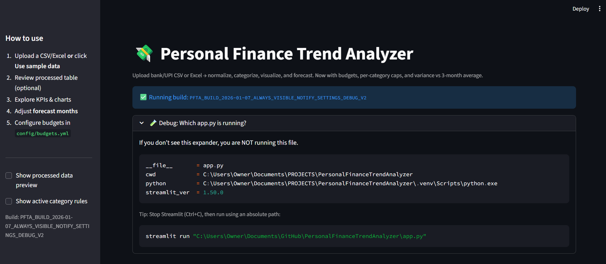
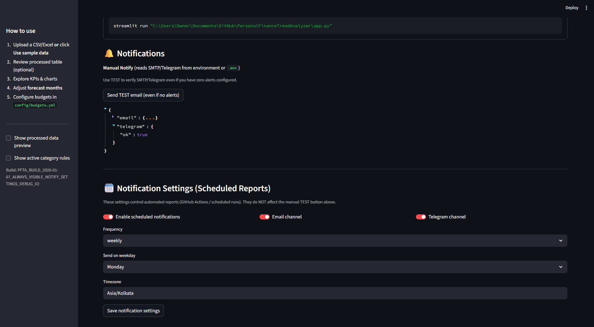
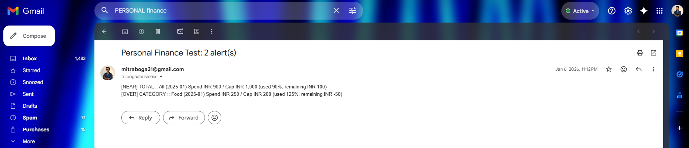
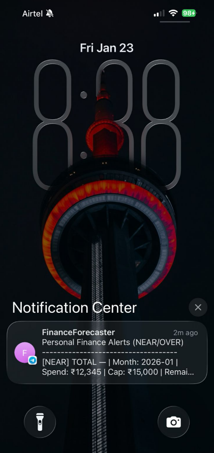
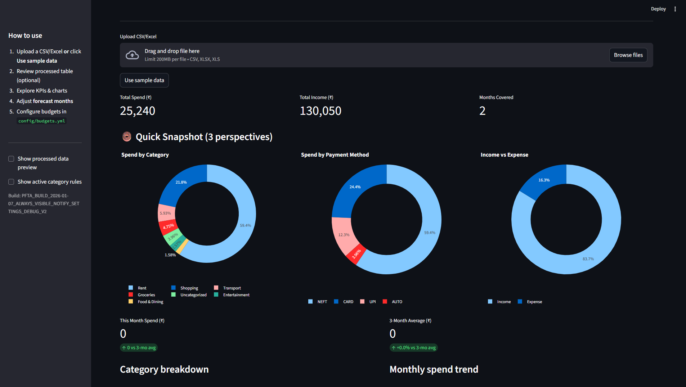
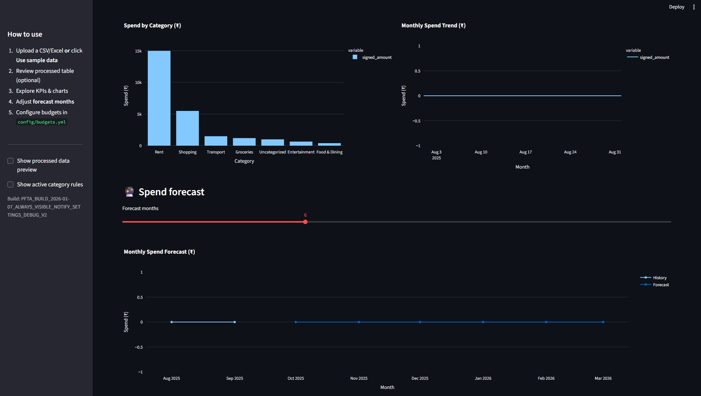
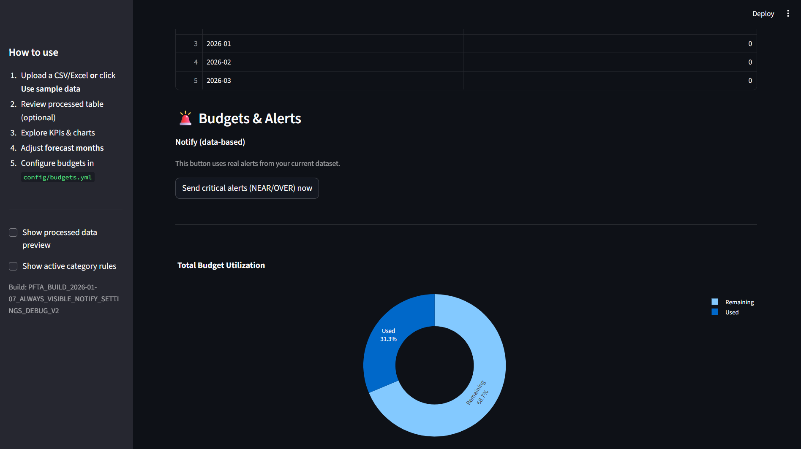
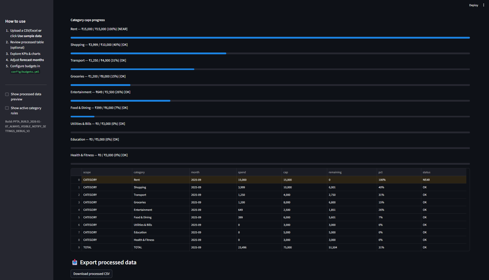

<h1 align="center">💵 Personal Finance Trend Analyzer (Streamlit) 💳</h1>
<h3 align="center">Streamlit Dashboard + Budget Guardrails + Forecasting + Email/Telegram Alerts</h3>

<p align="center">
  
  
  
  
  
  
  
  
  
  
  
</p>

---

<p align="center">
  <a href="https://mitraboga.github.io/EarningsCallSentimentAnalysis/" target="_blank" rel="noopener noreferrer">
    
  </a>
</p>

Users can upload their bank/UPI CSV, or Excel → **normalize + categorize** transactions → **visualize KPIs** → **forecast spending** → enforce **budgets & per-category caps** → send **Email/Telegram alerts**.

This project is built to feel like a mini “finance command center” — **fast insights**, **real-time budget pressure**, and **actionable alerts**.

---

## ✅ What this app does (end-to-end)

1) **Upload** a CSV/XLSX of transactions (or click **Use sample data**)  
2) App **cleans + normalizes** columns (dates, amounts, categories, payment methods)  
3) Builds KPIs and charts:
   - total spend, income, months covered
   - category breakdown + trend charts
   - donut snapshot (3 perspectives)
4) Runs **forecasting** for upcoming months (slider-controlled)
5) Applies **budgets**:
   - TOTAL cap
   - PER-CATEGORY caps
6) Sends **alerts**:
   - **NEAR** (close to limit)
   - **OVER** (exceeded)
7) Notification channels:
   - Email (SMTP)
   - Telegram (Bot + chat_id)
8) Supports both:
   - Manual “Send now / Test” notifications
   - Scheduled notification settings UI (for automation workflows)

---

## 🖼️ Streamlit Web App Visuals 

### 1) Home / App Boot Check + “Which app.py is running?”


**What you’re seeing:**
- Title banner: **Personal Finance Trend Analyzer**
- Left sidebar “How to use” checklist:
  1. Upload CSV/Excel or use sample data  
  2. Review processed table (optional)  
  3. Explore KPIs & charts  
  4. Adjust forecast months  
  5. Configure budgets in `config/budgets.yml`

**The “Debug: Which app.py is running?” expander:**
- Shows `__file__`, working directory, Python path, Streamlit version
- This is a **safety check** so you never accidentally run the wrong file from the wrong folder.
- It even prints the correct command to run Streamlit using an absolute path.

---

### 2) Notifications Section (Manual Notify + Scheduled Settings)


This screen shows two different “notification modes”:

#### ✅ A) Manual Notify (instant testing + instant sending)
- Button: **Send TEST email (even if no alerts)**
- Below it: output JSON/response confirming what worked
- Purpose: to verify user SMTP/Telegram config is correct **without needing real budget alerts**

#### ✅ B) Notification Settings (Scheduled Reports)
- Toggle: **Enable scheduled notifications**
- Channel toggles: **Email channel**, **Telegram channel**
- Frequency controls:
  - Frequency: weekly
  - Send on weekday: Monday
  - Timezone: Asia/Kolkata
- Button: **Save notification settings**

⚠️ Important: these scheduled settings are meant for automation (like scheduled runs / CI jobs).  
They are separate from the manual “TEST” actions above.

---

### 2.1) Email Test Success (Proof)

<details>
  <summary><b>Click to expand (Email Test Screenshot)</b></summary>
  <br/>
  
</details>

This screenshot proves:
- The app successfully sent an email with the subject:
  **“Test email from Personal Finance Trend Analyzer”**
- Meaning: SMTP creds + sender + recipient flow is working.

---

### 2.2) Telegram Test Success (Phone Notification Proof)

<details>
  <summary><b>Click to expand (Telegram Test Screenshot)</b></summary>
  <br/>
  
</details>

This screenshot proves:
- Telegram bot delivery is working
- The message includes the **budget severity** label:
  - **[NEAR]** (approaching limit)
- It includes a readable summary like:
  - Month
  - Spend
  - Cap
  - Remaining

In short: the app doesn’t just “notify” — it sends **action-ready context**.

---

### 3) Quick Snapshot (3 Donut Charts)


This section is designed for instant comprehension.

**Top KPIs displayed:**
- **Total Spend (₹)**
- **Total Income (₹)**
- **Months Covered**

**The 3 donut chart perspectives:**
1) **Spend by Category**
2) **Spend by Payment Method**
3) **Income vs Expense**

This is an “at-a-glance dashboard” that helps the user understand spending behaviour in ~5 seconds.

---

### 4) Forecasting Visuals (Category + Trend + Forecast Slider)


This section answers: **“Where is my spending going next?”**

**Visuals shown:**
- **Spend by Category (bar chart)**
- **Monthly Spend Trend (line chart)**

**Forecast block:**
- Slider: **Forecast months**
- Chart: **Monthly Spend Forecast**
  - shows history vs forecast lines

The purpose is to project spending forward so budgets can be proactive, not reactive.

---

### 5) Budgets & Alerts (Critical Notify + Utilization Donut)


This section turns the dashboard into a **financial guardrail system**.

**Key elements:**
- Button: **Send critical alerts (NEAR/OVER) now**
  - sends real alerts based on the current dataset + budget rules
- Donut chart: **Total Budget Utilization**
  - visualizes **Used vs Remaining**

This is the “pressure gauge” of the users' monthly finances.

---

### 6) Category Caps (Progress Bars + Table + Export)


This section is the users' **category-level budget enforcement**.

**What’s shown:**
- Progress bars per category showing:
  - spend vs cap
  - percent used
  - status: **OK / NEAR / OVER**
- A detailed table with columns like:
  - scope (CATEGORY / TOTAL)
  - category
  - month
  - spend
  - cap
  - remaining
  - pct
  - status

**Export processed data**
- Button: **Download processed CSV**
- Purpose: users can take the cleaned + categorized output into Excel/Sheets/Power BI.

---

## 📁 Repo Structure 

```text
.
├── .github/                 # workflows / actions (optional automation)
├── .pytest_cache/           # pytest cache
├── .venv/                   # local virtual environment (ignored in git)
├── .vscode/                 # editor settings
├── config/                  # configuration (budgets, rules, etc.)
├── data/                    # sample / raw input files (optional)
├── outputs/                 # generated outputs (processed files, exports, etc.)
├── outputs_cli_test/        # CLI testing outputs
├── outputs_test/            # test artifacts
├── outputs_weekly_test/     # scheduled-run style test outputs
├── pipeline/                # core data pipeline logic
├── scripts/                 # helper scripts (batch runs, utilities)
├── state/                   # saved settings/state (scheduled notify settings, etc.)
├── tests/                   # pytest test suite
├── .env                     # secrets (SMTP/Telegram) - DO NOT COMMIT
├── assets                   # screenshots of the streamlit web application
├── app.py                   # Streamlit app entry point
├── README.md
└── requirements.txt
```
---
## 🔁 CI/CD (GitHub Actions + Streamlit Community Cloud)

This project is built like a production analytics tool:

- **CI (Continuous Integration)** ensures every change is tested automatically.
- **CD (Continuous Delivery)** ships the Streamlit UI automatically and runs scheduled reporting/notifications.

---

### CI — Continuous Integration (GitHub Actions)

On every push / pull request, GitHub Actions can:

1. Create a clean Python environment
2. Install dependencies from `requirements.txt`
3. Run the test suite with `pytest`

**Why it matters:** prevents regressions in ingestion/cleaning/categorization as the project evolves.

**Typical workflow file:** `.github/workflows/ci.yml`  
**Typical command:** `pytest -q`

---

### CD — Continuous Delivery (Streamlit Community Cloud + Scheduled Pipelines)

This project uses **two delivery paths**:

#### 1) UI Delivery (Streamlit Community Cloud)
The **Streamlit dashboard** is deployed via **Streamlit Community Cloud** (free for public apps):

- Connect GitHub repo to Streamlit Cloud
- Choose `app.py` as the entrypoint
- Every push to `main` triggers an automatic redeploy

**Result:** the latest version of the dashboard is always live without manual deployment.

#### 2) Automated Delivery of Reports (GitHub Actions Scheduler)
For a data/ML product, “delivery” also means **shipping outputs** (reports/alerts), not just deploying a web server.

A scheduled GitHub Actions workflow can run daily and:

- Execute `python -m scripts.weekly_summary ... --notify`
- Generate outputs (CSVs/HTML charts)
- Send alerts via **Email and/or Telegram**
- Update `state/notify_state.json` to prevent duplicate sends (idempotent scheduling)

**Result:** production-style automation loop:
- “Run → generate insights → notify → persist state → repeat”

---

### Secrets & Safety (No Hardcoded Credentials)

Sensitive values are never committed to GitHub. They are stored as:

- **Streamlit Cloud Secrets** (for the dashboard)
- **GitHub Actions Secrets** (for scheduled notifications)

Examples:
- `SMTP_HOST`, `SMTP_PORT`, `SMTP_USER`, `SMTP_PASS`
- `EMAIL_FROM`, `EMAIL_TO`
- `TELEGRAM_BOT_TOKEN`, `TELEGRAM_CHAT_ID`

---

### Summary (Interview-ready)

- ✅ **CI:** GitHub Actions runs tests automatically on each change.
- ✅ **CD (UI):** Streamlit Community Cloud auto-deploys the dashboard from GitHub.
- ✅ **CD (Analytics Ops):** Scheduled GitHub Actions runs the pipeline, generates reports, and sends alerts.

---

## ⚙️ Setup

### 1) Create + activate a virtual environment

**Windows**
```bash
python -m venv .venv
.venv\Scripts\activate
```

**macOS/Linux**
```bash
python -m venv .venv
source .venv/bin/activate
```

### 2) Install dependencies
```bash
-m pip install -r requirements.txt
```

### 3) Create `.env`
The repo already has a `.env` file shown in the screenshot — keep it **OUT of git**.

Typical values:

```env
# Email (SMTP)
SMTP_HOST=smtp.gmail.com
SMTP_PORT=587
SMTP_USER=your_email@gmail.com
SMTP_PASS=your_app_password
ALERT_EMAIL_TO=destination_email@gmail.com

# Telegram
TELEGRAM_BOT_TOKEN=123456:ABCDEF...
TELEGRAM_CHAT_ID=123456789
```

### 4) Run the app
```bash
-m streamlit run app.py
```

---

## 🧠 How the pipeline works (high-level)

```text
Upload CSV/XLSX
   ↓
Normalize columns (dates, amounts, type)
   ↓
Categorize spend (rules + defaults)
   ↓
Aggregate monthly KPIs + groupby metrics
   ↓
Charts + donuts + trends
   ↓
Forecast (months slider → forward projection)
   ↓
Budget engine:
   - TOTAL cap
   - CATEGORY caps
   ↓
Alert engine:
   OK / NEAR / OVER
   ↓
Notify:
   - TEST email/telegram
   - Send critical alerts now
   - Scheduled settings saved for automation
```

---

## 🧾 Budgets Configuration

From your sidebar instructions, budgets are configured here:

- `config/budgets.yml`

That file typically controls:
- TOTAL monthly cap
- per-category caps (Rent, Shopping, Transport, etc.)
- thresholds used to classify:
  - **NEAR** (approaching cap)
  - **OVER** (exceeded cap)

---

## ✅ Testing

Run the test suite:

```bash
pytest -q
```

The repo also includes multiple output folders used to validate:
- manual tests
- CLI tests
- weekly/scheduled-style tests

---

## 🚀 Roadmap (easy upgrades)

- Add merchant-level insights (top merchants + month-over-month shifts)
- Add recurring bill detection
- Add anomaly detection (sudden spikes)
- Add multi-account / multi-file merging
- Add Streamlit Community Cloud deployment guide

---

## 👤 Author

<p align="center">
  <b style="font-size:18px;">Mitra Boga</b><br/><br/>

  <!-- LinkedIn: true blue label + lighter-blue username block -->
  <a href="https://www.linkedin.com/in/bogamitra/" target="_blank" rel="noopener noreferrer">
    
  </a>

  <!-- X: near-black label + darker-gray username block (dark-mode friendly) -->
  <a href="https://x.com/techtraboga" target="_blank" rel="noopener noreferrer">
    
  </a>
</p>
